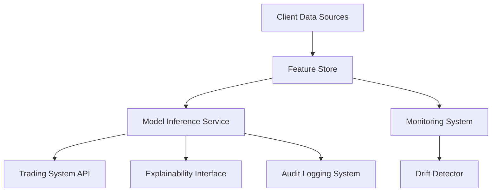

# AI-Driven Infrastructure Blueprint

## Metadata

| Field         | Value                             |
|---------------|-----------------------------------|
| Document ID   | IDBX-ARCH-AI-v1-2025.0            |
| Module        | ARCH                              |
| Version       | v1.0                              |
| Date          | 2025-05-25        |
| Authors       | Mahmut Gülerce (Global CSTO)      |

---

## 1. Purpose

To define the reference architecture and deployment practices for IDBX’s AI infrastructure, ensuring scalability, compliance, performance, and real-time integration with trading systems.

---

## 2. Architectural Goals

- High-throughput AI inference with low latency
- Horizontal scalability across clouds and zones
- Modular deployment for isolation and control
- End-to-end auditability and explainability
- Seamless integration with trading engine and APIs

---

## 3. Core Components

| Component           | Description                                       |
|---------------------|---------------------------------------------------|
| Model Serving Layer | Real-time inference (e.g., TensorFlow Serving)    |
| Feature Store       | Real-time and batch features for reuse            |
| Data Ingestion      | Stream + batch pipelines (Kafka, Flink)           |
| Monitoring & Explainability | SHAP values, drift detection, XAI UI     |
| Storage             | Encrypted S3, archival tiering, hot/cold storage |
| Deployment Platform | Kubernetes with Istio, CI/CD integration         |

---

## 4. Reference Architecture Diagram

---

## 5. Deployment Standards

- Containerized model packages (Docker)
- Canary rollout and rollback enabled via GitOps
- GPU autoscaling for model-specific workloads
- Ingress and service mesh secured with mTLS

---

## 6. Integration with IDBX Platform

- Models output tagged `AI-Augmented`
- Compliance hooks inserted at output level
- Signals injected into real-time order strategies
- Logs correlated to trade audit records (MiFID II)

---

## 7. Security & Isolation

- Each model served in isolated namespace
- Inter-service traffic encrypted and signed
- Access via RBAC and IAM federation
- External model endpoints disallowed

---

## 8. Governance & Maintenance

- All deployments registered in AI Compliance Register
- Performance and drift reviewed monthly
- Emergency kill-switch maintained for each model route
- Architecture reviewed quarterly by CSTO and AI Ops team

---

*This document is the property of IDBX Corporation Ltd. External use prohibited without written authorization.*
