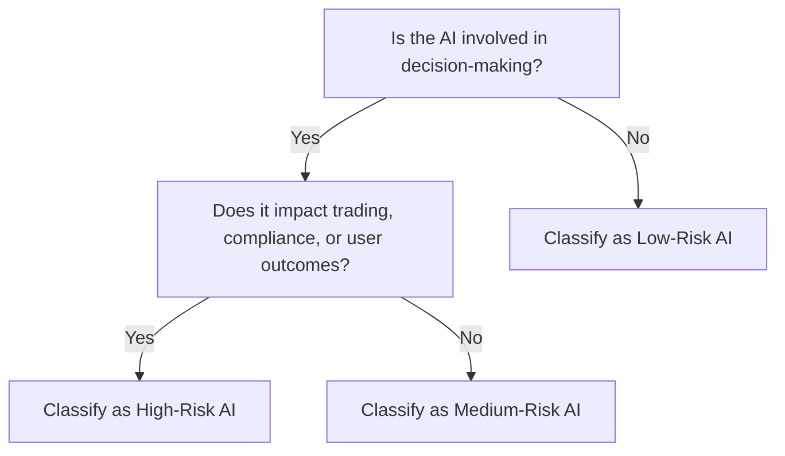
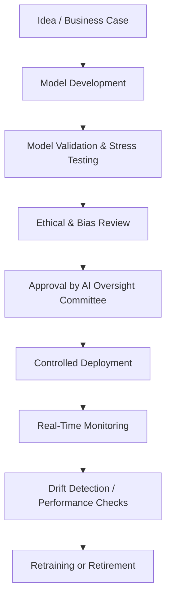
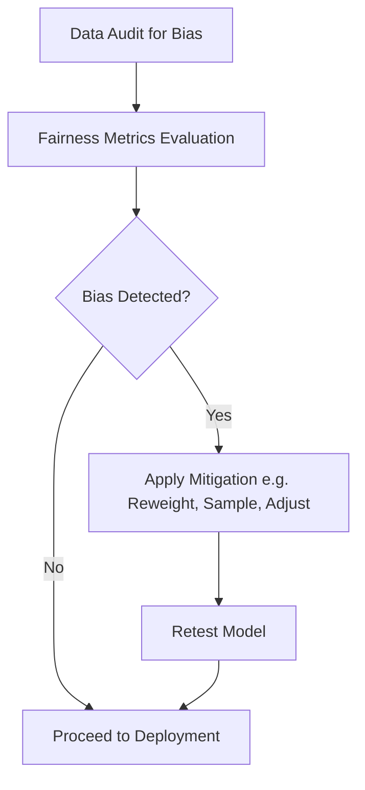
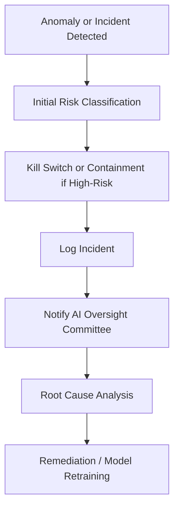
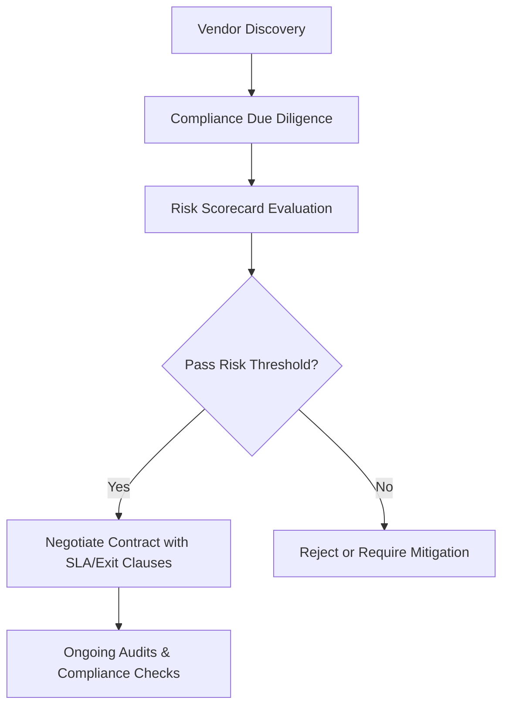

# AI Risk & Governance Framework

## Metadata

| Field         | Value                             |
|---------------|-----------------------------------|
| Document ID   | IDBX-POL-AI-v1-2025.0             |
| Module        | AI                                |
| Version       | v1.0                              |
| Date          | 2025-05-21        |
| Authors       | Mahmut Gülerce (Global CSTO)      |

---

## 1. Purpose

This framework establishes the standards and responsibilities for the design, deployment, oversight, and monitoring of Artificial Intelligence (AI) systems within IDBX. It ensures that all AI applications align with legal, ethical, operational, and regulatory requirements.

---

## 2. Scope

Applies to:
- All AI models deployed within the IDBX ecosystem
- All departments using AI for trade execution, compliance, or analytics
- All internal and third-party developed AI components
- All IDBX jurisdictions, including EU, UK, GCC, and US markets

---

## 3. Governance Structure

- **AI Oversight Committee (AOC)**: Cross-functional committee responsible for AI governance policy, review, and escalation.
- **Model Risk Team**: Manages risk classification, validation, and monitoring of AI models.
- **AI Ethics Officer**: Ensures fairness, transparency, and bias mitigation across models.

---

## 4. Risk Classification

AI systems are classified based on impact and regulatory exposure:

| Risk Level | Description                                | Examples                                      |
|------------|--------------------------------------------|-----------------------------------------------|
| High       | Legal, financial, or systemic consequences | Trade recommendations, KYC/AML flagging       |
| Medium     | Operational disruptions                    | Internal predictive analytics, sentiment tools|
| Low        | Minimal impact                             | UI personalization, content recommendations   |

---

## 5. Lifecycle Controls

### 5.1 Model Development
- Code must be stored in version control with audit logs
- Training data must be validated for bias and diversity
- All models require peer review and approval before deployment

### 5.2 Model Validation
- Mandatory stress testing and backtesting
- Bias detection using fairness metrics (e.g., demographic parity, equal opportunity)
- Explainability tools must be applied (SHAP, LIME, etc.)

### 5.3 Deployment
- All models are released through controlled CI/CD with rollback capability
- Production models must have logging, monitoring, and kill switches

### 5.4 Monitoring
- Real-time drift detection and alerting
- Model performance dashboard (accuracy, false positives, latency)
- Periodic revalidation every 6–12 months

---

## 6. Explainability Standards

- Use of inherently interpretable models when feasible
- Post-hoc explainability (e.g., SHAP values) required for all black-box models
- Explanation summaries must be available to:
  - Traders using AIDANN output
  - Compliance and audit personnel
  - Regulators, upon request

---

## 7. Regulatory Alignment

- **EU AI Act**: All high-risk models comply with risk, logging, and oversight mandates
- **MiFID II**: Model output logs tied to trading activity
- **GDPR**: Right to explanation and data minimization enforced
- **FCA/SEC Guidance**: Auditability and human override maintained

---

## 8. Bias & Fairness Framework

- Pre-deployment data audit for imbalance and exclusion
- Real-time bias detectors flag discrepancies across protected attributes
- Bias mitigation through reweighting, sampling, or algorithmic adjustments
- All fairness issues must be remediated before deployment or retraining

---

## 9. Risk Mitigation Controls

- **Fallback Plans**: Human-in-the-loop or rule-based backup for high-risk models
- **Kill Switches**: Immediate deactivation of any model in violation of performance or ethical standards
- **Incident Response**: AI incidents follow IDBX-PLAN-SEC procedures with forensics and remediation review

---

## 10. Third-Party AI Vendor Risk

- Due diligence required on all third-party AI solutions
- Vendors must share model documentation, training sources, and testing results
- SLAs must include explainability, error limits, retraining schedules, and exit plans

---

## 11. Documentation & Audit

- Each model must have a full model card:
  - Purpose, version, owner
  - Training data sources
  - Evaluation metrics
  - Limitations and known risks
- Logs must be immutable and exportable for regulatory inspection

---

## 12. Review & Maintenance

- Annual framework review by the AOC
- Continuous regulatory monitoring
- Mandatory training for all developers and data scientists on AI governance

---

*This document is the property of IDBX Corporation Ltd. Reproduction or distribution without permission is prohibited.*
