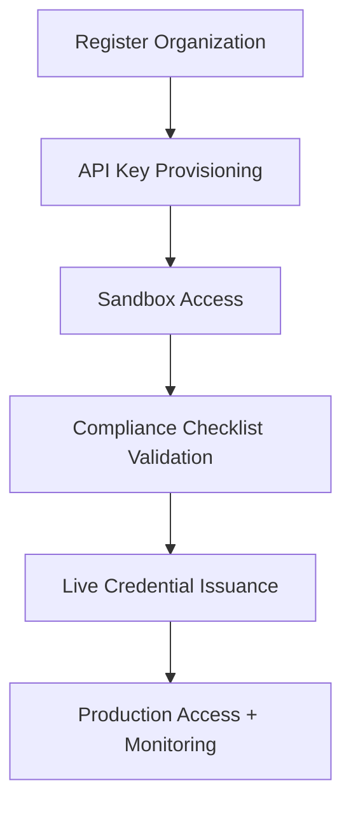

# API & Integration Suite

## Metadata

| Field         | Value                             |
|---------------|-----------------------------------|
| Document ID   | IDBX-SPEC-API-v1-2025.0           |
| Module        | API                               |
| Version       | v1.0                              |
| Date          | 2025-05-23        |
| Authors       | Mahmut Gülerce (Global CSTO)      |

---

## 1. Purpose

This document defines the standards and design of IDBX's public and institutional API suite, including authentication, AI integration, observability, and change control.

---

## 2. API Design Principles

- RESTful and WebSocket hybrid architecture
- Predictable versioning and backwards compatibility
- Built-in observability and regulatory traceability
- Scope-based access with strict rate limiting
- All AI-derived endpoints transparently marked

---

## 3. API Categories

| Category        | Protocol       | Functionality                                    |
|------------------|----------------|--------------------------------------------------|
| Market Data Feed | WebSocket      | Real-time pricing, order book updates            |
| Trading API      | REST/WebSocket | Order placement, modification, cancellation      |
| Compliance API   | REST           | Audit exports, transaction trace, MiFID reports  |
| AI Insights API  | REST           | AIDANN-generated predictive trading signals      |

---

## 4. Security & Access Control

- OAuth 2.0 with rotating JWT tokens
- Optional mTLS for high-sensitivity use cases
- Tokens scoped by feature group (trade, data, compliance)
- IP-level and token-level rate enforcement
- All access logged and subject to monitoring

---

## 5. Endpoint Directory (v1)

```text
GET    /v1/market/ticker
GET    /v1/market/orderbook
POST   /v1/trade/order
PUT    /v1/trade/order/{id}
DELETE /v1/trade/order/{id}
GET    /v1/compliance/report/{date}
GET    /v1/ai/signal/{instrument}
```

---

## 6. AIDANN Endpoint Sample

```json
{
  "instrument": "EUR/USD",
  "signal_strength": 0.82,
  "confidence_score": 0.91,
  "model_version": "aidann-v1.0",
  "explanation": "Upward momentum with volatility normalization",
  "regulatory_tag": "AI-Augmented"
}
```

---

## 7. Onboarding & Integration Workflow



---

## 8. Versioning & Deprecation

- Semantic versioning with `/v1/`, `/v2/`, etc.
- Deprecated endpoints maintained for 90 days post notice
- Legacy endpoints return HTTP 410 with upgrade guidance

---

## 9. Telemetry & Monitoring

- Metrics include request count, latency, error rate, and scope
- Alerting via Grafana or partner integration dashboards
- Partners may request Prometheus-compatible pull endpoints

---

## 10. Change Control & Feature Requests

- Quarterly review cycles for new endpoint proposals
- Emergency patches allowed via fast-track escalation
- All updates communicated via release notes and changelogs

---

*This document is proprietary to IDBX Corporation Ltd. External use must be authorized in writing.*
