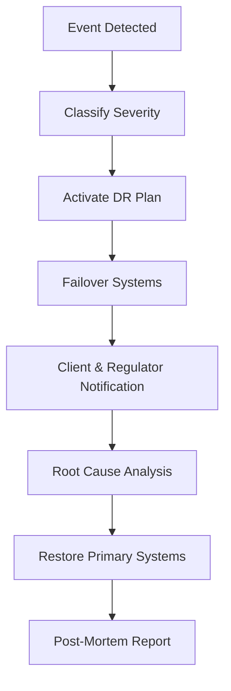

# Business Continuity & Disaster Recovery Plan

## Metadata

| Field         | Value                                  |
|---------------|----------------------------------------|
| Document ID   | IDBX-PLAN-CORE-v1-2025.0               |
| Module        | CORE                                   |
| Version       | v1.0                                   |
| Date          | 2025-05-24             |
| Authors       | Mahmut Gülerce (Global CSTO)           |

---

## 1. Purpose

This plan ensures that IDBX can continue its operations and recover critical systems quickly in the event of a serious disruption or disaster, safeguarding platform integrity, client trust, and regulatory compliance.

---

## 2. Scope

Applies to:
- All critical components: trading systems, AI systems, APIs, and data services
- Supporting infrastructure and internal business operations
- All locations and cloud regions where IDBX operates

---

## 3. Key Objectives

- Maintain continuity of operations
- Minimize downtime and data loss
- Protect human safety and digital assets
- Comply with legal and regulatory continuity requirements

---

## 4. Risk Assessment

| Threat                 | Likelihood | Impact  | Mitigation                          |
|------------------------|------------|---------|-------------------------------------|
| Cloud provider failure | Medium     | High    | Multi-zone deployment, autoscaling |
| Cyberattack            | High       | High    | 24/7 monitoring, incident response |
| Data corruption        | Medium     | High    | Immutable backups, checksums       |
| Natural disaster       | Low        | Medium  | Geographic redundancy               |
| Insider threat         | Medium     | High    | RBAC, access reviews, alerting     |

---

## 5. System Recovery Targets

| System                    | Recovery Time (RTO) | Data Loss Tolerance (RPO) |
|---------------------------|---------------------|----------------------------|
| Trading Engine            | 15 minutes          | 5 seconds                  |
| Client-Facing APIs        | 30 minutes          | 10 minutes                 |
| AI (AIDANN) Infrastructure| 1 hour              | 15 minutes                 |
| Internal Operations       | 4 hours             | 24 hours                   |

* Platform-level RTO/RPO targets (e.g., in Trading Platform Spec) are overarching availability commitments. Component-level values (e.g., for Trading Engine or AIDANN) represent subsystem recovery expectations and may vary accordingly. Where multiple targets apply, the stricter (lower) value governs external service commitments.

---

## 6. Business Continuity Strategy

- Live data replication across regions
- Cloud-agnostic design (containers, Kubernetes)
- Remote work fallback for operations teams
- Role-based emergency escalation paths
- Daily encrypted backups with geographic separation

---

## 7. Disaster Recovery Flow

---

## 8. Backup Policy

- Hourly incremental snapshots
- Daily full encrypted backups
- Stored in immutable storage with audit logs
- Weekly validation through restore simulations

---

## 9. Communication Framework

- Emergency contacts registered per department
- Multi-channel alerts: SMS, Slack, secure email
- Clients updated via status portal and direct outreach
- Templates pre-approved for regulator disclosures

---

## 10. Team Roles

- **CSTO**: Executive sponsor and final authority
- **DR Lead**: Coordinates plan activation and recovery teams
- **Operations & Infra Teams**: Validate failovers, restore services
- **Compliance & Legal**: Handle audits and regulator comms

---

## 11. Testing & Review

- Full disaster recovery test annually
- Tabletop simulation every 6 months
- Lessons logged and plans updated as required

---

## 12. Policy Governance

- Reviewed bi-annually
- Approved updates logged in governance system
- Mandatory employee briefing after each major revision

---

*This document is the property of IDBX Corporation Ltd. Do not distribute externally without written authorization.*
