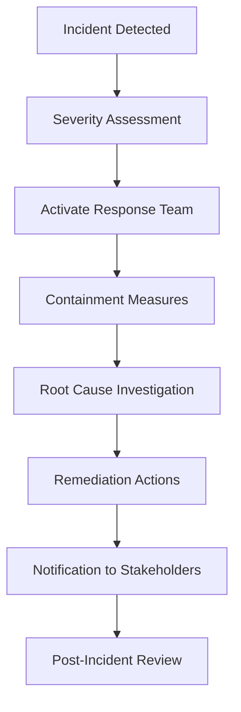

# Cybersecurity Incident Response Plan

## Metadata

| Field         | Value                                 |
|---------------|---------------------------------------|
| Document ID   | IDBX-PLAN-SEC-v1-2025.0               |
| Module        | SEC                                   |
| Version       | v1.0                                  |
| Date          | 2025-05-23            |
| Authors       | Mahmut Gülerce (Global CSTO)          |

---

## 1. Purpose

To define the processes and responsibilities for detecting, managing, mitigating, and learning from cybersecurity incidents that affect the IDBX platform, infrastructure, data, or partners.

---

## 2. Scope

Covers all incidents involving:
- Unauthorized access attempts or data breaches
- Denial of service attacks
- Malware, ransomware, or phishing threats
- Insider threats or policy violations
- Vulnerability exploitation of any production or dev environment

---

## 3. Incident Classification

| Severity | Description                              | Examples                                  |
|----------|------------------------------------------|-------------------------------------------|
| Critical | Immediate threat to systems or data       | Active breach, ransomware, data exfiltration |
| High     | Likely to escalate or interrupt services  | DDoS, unauthorized admin access            |
| Medium   | Contained but requires response           | Malware detection, suspicious login       |
| Low      | Non-impactful or mitigated automatically  | Minor policy violations, blocked scans    |

---

## 4. Detection & Alerting

- Real-time monitoring of all infrastructure, APIs, and endpoints
- Alerts generated via:
  - SIEM systems (Elastic, Wazuh)
  - Endpoint protection tools
  - Anomaly detection by AI or analytics
- All alerts are assigned severity and logged for investigation

---

## 5. Response Workflow

---

## 6. Containment & Mitigation

- Isolate affected systems
- Revoke or rotate credentials
- Disable exposed services or ports
- Deploy WAF or firewall rules
- Backup validation and integrity scan

---

## 7. Notification Protocols

- Internal:
  - CSTO must be notified within 1 hour
  - Legal, Compliance, and Operations briefed as needed
- External:
  - DPO notifies regulators (e.g., under GDPR within 72 hours)
  - Clients notified if data exposure affects them directly

---

## 8. Evidence Handling

- Chain-of-custody maintained for all forensic logs
- Volatile memory captured if required
- Screenshots and exportable reports stored in secure incident vault
- All evidence encrypted and access logged

---

## 9. Recovery & Restoration

- Clean system images deployed after validation
- Patching and configuration hardening completed
- Monitor restored services for post-incident anomalies
- Review backups for integrity before restoration

---

## 10. Post-Incident Review

- Conducted within 7 days of incident closure
- Includes:
  - Timeline reconstruction
  - Root cause analysis
  - Remediation effectiveness
  - Required updates to policies or training

---

## 11. Training & Simulation

- Annual incident response simulation (tabletop and live)
- Quarterly team review of recent threat landscape changes
- Rotational on-call assignment for 24/7 response coverage

---

## 12. Plan Review & Change Control

- Plan reviewed semi-annually
- Updates must be approved by the CSTO and Security Governance Committee
- Changes logged in the cybersecurity control register

---

*This document is the confidential property of IDBX Corporation Ltd. Unauthorized reproduction is prohibited.*
