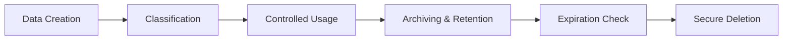

# Data Governance & Privacy Framework

## Metadata

| Field         | Value                                  |
|---------------|----------------------------------------|
| Document ID   | IDBX-POL-DATA-v1-2025.0                |
| Module        | DATA                                   |
| Version       | v1.0                                   |
| Date          | 2025-05-23             |
| Authors       | Mahmut Gülerce (Global CSTO)           |

---

## 1. Purpose

To establish policies and standards that ensure secure, compliant, and ethical management of all data within the IDBX ecosystem, including client, trade, analytical, and AI training data.

---

## 2. Scope

Covers all data handled by IDBX:
- Trade-related data
- Client identifiers and metadata
- Model input and output data
- Internal analytics and logs
- Data from integrated third-party platforms

---

## 3. Data Classification

| Classification | Description                            | Examples                                 |
|----------------|----------------------------------------|------------------------------------------|
| Public         | Public-facing, non-sensitive data       | Market summaries, brochures              |
| Internal       | Internal-use data with low sensitivity  | Dev logs, internal reports               |
| Confidential   | Client or proprietary business data     | Trade logs, risk models, signal outputs  |
| Restricted     | Legally protected or regulated data     | KYC data, PII, compliance records        |

---

## 4. Data Privacy Principles

- **Minimization**: Only collect data strictly necessary for the intended purpose.
- **Consent**: Client consent must be obtained for any data involving personal or sensitive information.
- **Purpose Limitation**: Data must not be repurposed beyond original intent without reauthorization.
- **Retention**: Data is retained per applicable regulation (e.g., 5–7 years for trade logs) then securely deleted.

---

## 5. Data Ownership & Stewardship

- Data generated by clients belongs to clients; IDBX is the processor.
- Trade and system metadata belong to IDBX.
- Every data asset must have a designated Data Steward responsible for classification, quality, and lifecycle.
- A designated **Data Protection Officer (DPO)** oversees governance policy, privacy compliance, and breach reporting.

---

## 6. Risk Management

- Data risk is assessed based on sensitivity, exposure potential, and regulatory impact.
- High-risk datasets must undergo quarterly review and technical security audit.
- Risk scores are maintained in the internal compliance register and used to prioritize mitigation.

---

## 7. Access Control

- Access to Restricted and Confidential data requires RBAC approval.
- All access is logged with:
  - User ID and timestamp
  - Scope and method of access
  - Session token or system signature
- Admin access requires MFA and quarterly recertification.
- All staff must complete annual data governance and privacy training.

---

## 8. Data Security Standards

- All data at rest is encrypted (AES-256)
- Data in transit is protected by TLS 1.3
- Anonymization is applied to production copies used in dev/test
- Daily snapshot backups are retained in immutable storage (30 days)

---

## 9. Third-Party Data Handling

- Vendors must adhere to this policy and provide evidence of:
  - Data segregation and encryption practices
  - Privacy compliance (GDPR, CCPA, etc.)
  - Breach response plans
- All data-sharing agreements must be approved by Legal and CSTO

---

## 10. Regulatory Alignment

- **GDPR**: Data subject rights (access, correction, erasure)
- **CCPA**: Opt-out for data sales and profiling
- **MiFID II**: Trade data retention and audit logging
- **Basel III**: Risk model transparency and traceability

---

## 11. Data Lifecycle Management

- Creation → Classification → Usage → Archiving → Deletion
- Expired data is purged using secure, verified deletion tools
- Archived data must be stored in a format readable for 10 years minimum

---

## 12. Auditing & Breach Handling

- All systems undergo quarterly privacy audits
- Security incidents involving data must:
  - Be reported to the DPO within 24 hours
  - Trigger forensic log analysis and regulator notification (if required)
- Post-breach reviews must define corrective actions and timeline

---

## 13. Transparency & Communication

- Clients and partners receive clear summaries of privacy principles and processing rights
- A public-facing privacy notice is maintained and reviewed annually

---

## 14. Review & Enforcement

- This policy is reviewed annually by the CSTO and DPO.
- Non-compliance may result in disciplinary action or vendor suspension.

---

*This document is confidential and property of IDBX Corporation Ltd. Unauthorized use is strictly prohibited.*
