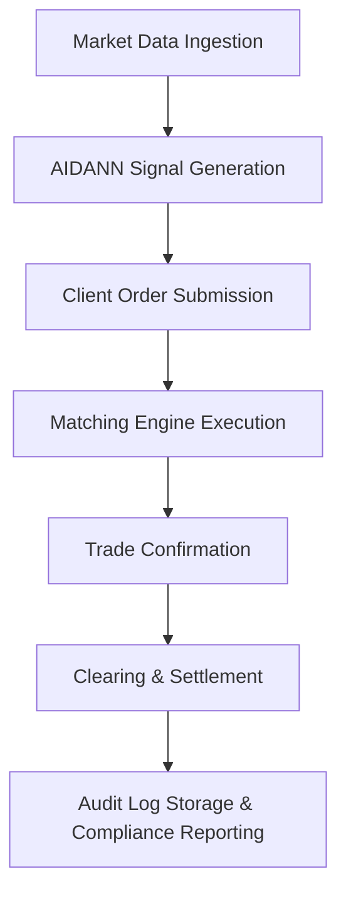

# IDBX Trading Platform System Specification

## Metadata

| Field         | Value                                 |
|---------------|---------------------------------------|
| Document ID   | IDBX-SPEC-TRADE-v1-2025.0             |
| Module        | TRADE                                 |
| Version       | v1.0                                  |
| Date          | 2025-05-22            |
| Authors       | Mahmut Gülerce (Global CSTO)          |

---

## 1. Overview

This document provides the detailed technical specification for the IDBX trading platform, including architectural components, system design, key features, and regulatory integration.

---

## 2. Platform Architecture

### 2.1 Core Components

- **Trading Engine**: Low-latency, deterministic engine responsible for order matching and execution priority.
- **Data Distribution Layer**: Real-time publishing of market data and analytical signals.
- **AI Intelligence Layer**: Integrates AIDANN outputs into trading signals, alerts, and execution recommendations.
- **Compliance Layer**: Logs, audits, and validates trade behavior against regulatory frameworks.
- **Client Access APIs**: Secure REST and WebSocket interfaces for institutional access and automation.
- **Settlement & Clearing Bridge**: Integrates with custodians, clearinghouses, and back-office systems.

---

## 3. Order Lifecycle & Trade Flow

### 3.1 Phases

1. **Pre-Trade**
   - Market data ingestion
   - AIDANN-driven signal generation
   - Client-side strategy planning

2. **Execution**
   - Order submission and routing
   - Matching engine execution
   - Timestamping, fee calculation, priority logic

3. **Post-Trade**
   - Confirmation, reporting, and settlement prep
   - Regulatory reporting (MiFID II, TRACE)
   - Archiving and audit trail generation

---

## 4. Execution Logic

### 4.1 Order Matching Algorithm

- **Priority Model**: Time-priority within price level
- **Liquidity-Aware Routing**: Routes orders toward optimal venue based on real-time liquidity
- **Atomic Execution Handling**: Ensures fill-or-kill enforcement, prevents partial trade risks

---

## 5. Security & Integrity

- TLS 1.3 encryption for all data in motion
- MFA and token-based authentication
- Role-Based Access Control (RBAC)
- Immutable audit trail logging via blockchain hashing

---

## 6. Latency and Performance Benchmarks

- Matching engine latency target: **<200μs**
- Market data refresh: **<10ms**
- Concurrent order processing throughput: **>1 million per second**

---

## 7. Regulatory Integration

- **MiFID II**: Trade tagging, audit, RTS 27/28 reports
- **Basel III**: Integration of AIDANN’s exposure outputs for capital calculations
- **GDPR**: Trade data anonymization & client opt-out integration
- **EU AI Act**: All AIDANN-assisted outputs tagged as "AI-Augmented" for downstream traceability

---

## 8. Logging & Observability

- All system actions are logged via a centralized ELK stack
- Trade-level logs include:
  - Timestamped action trail
  - AI contribution confidence score
  - User identity and device info
- Alerts routed via Prometheus & Grafana dashboards

---

## 9. Failover & Disaster Recovery

- Hot-standby replication across availability zones
- Real-time data journaling
- Recovery Point Objective (RPO): 5 seconds
- Recovery Time Objective (RTO): 30 seconds

---

## 10. Roadmap for Enhancements

- Multi-asset support (e.g. FX, crypto, CDS)
- Smart Order Routing based on AI reinforcement learning
- Self-service compliance module for institutional clients

---

*This document is confidential and the property of IDBX Corporation Ltd. Redistribution is strictly prohibited without authorization.*
