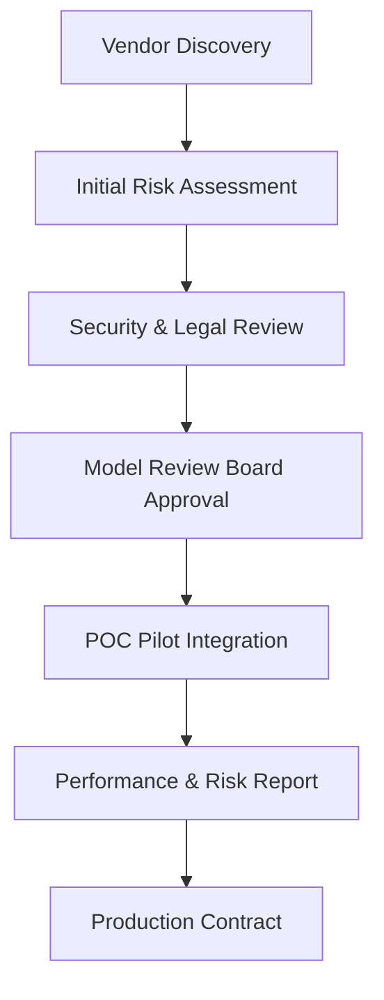

# Third-Party AI Vendor Risk Policy

## Metadata

| Field         | Value                                  |
|---------------|----------------------------------------|
| Document ID   | IDBX-POL-VENDOR-v1-2025.0              |
| Module        | VENDOR                                 |
| Version       | v1.0                                   |
| Date          | 2025-05-25             |
| Authors       | Mahmut Gülerce (Global CSTO)           |

---

## 1. Purpose

To define the risk management principles and due diligence requirements for all third-party AI technologies, platforms, and models used by or integrated into IDBX systems.

---

## 2. Scope

Applies to:
- All AI tools or services procured externally
- Open-source AI components integrated into IDBX infrastructure
- Vendors providing APIs or ML models with inference capabilities
- Cloud-based or on-prem AI solutions influencing IDBX decisions

---

## 3. Risk Categories

| Risk Type       | Description                                     |
|------------------|-------------------------------------------------|
| Data Privacy     | Misuse or mishandling of client or platform data|
| Explainability   | Black-box models without reasoning or traceability |
| Model Bias       | Discrimination risk from biased training data   |
| Security         | Exposure to malware, supply chain compromise    |
| Regulatory       | Non-compliance with GDPR, EU AI Act, etc.       |
| Continuity       | Vendor shutdown, instability, or poor SLA       |

---

## 4. Due Diligence Requirements

All vendors must provide:
- Documented model architecture and training data sources
- Information security policy aligned with ISO 27001 or equivalent
- Data processing agreements (DPAs) and compliance evidence
- Proof of bias testing and mitigation practices
- Contractual SLAs for uptime, error rates, and model retraining

---

## 5. Evaluation Process

---

## 6. Risk Scoring Model

Each vendor is rated across:

- Data handling compliance
- Model transparency and documentation
- Past security incidents
- SLA reliability and support access
- Organizational maturity

Vendors with High Risk must be either:
- Rejected
- Segmented and sandboxed with real-time monitoring
- Subject to quarterly review and limited production use

---

## 7. Ongoing Oversight

- Vendors are reviewed annually or after major updates
- Any incident (e.g., drift, exploit, misclassification) triggers escalation
- Access logs, performance metrics, and retraining cadence must be auditable

---

## 8. Termination & Exit Strategy

- Contracts must include:
  - Offboarding support and data return procedures
  - Retraining data ownership clauses
  - Post-termination model disposal requirements
- IDBX maintains fallback alternatives for all external AI models

---

## 9. Review & Enforcement

- Policy is reviewed annually by the CSTO and Procurement
- Violations or third-party breaches trigger incident response
- Persistent non-compliance may result in vendor suspension or blacklist

---

*This document is the property of IDBX Corporation Ltd. Unauthorized reproduction is prohibited.*
