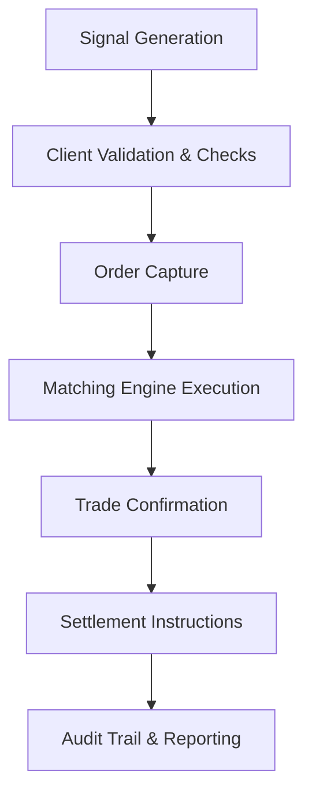

# Trade Lifecycle Management Policy

## Metadata

| Field         | Value                                  |
|---------------|----------------------------------------|
| Document ID   | IDBX-POL-TRADE-v1-2025.0               |
| Module        | TRADE                                  |
| Version       | v1.0                                   |
| Date          | 2025-05-23             |
| Authors       | Mahmut Gülerce (Global CSTO)           |

---

## 1. Purpose

This policy defines the structure, controls, and traceability expectations for managing the lifecycle of institutional trades processed by the IDBX platform, from initiation to post-trade audit.

---

## 2. Scope

Applies to:
- All trade-related workflows handled by IDBX
- AIDANN-generated signals leading to trades
- Manual and automated trading input
- All regions and market types (equity, FX, credit, derivatives)

---

## 3. Trade Lifecycle Stages

### 3.1 Pre-Trade
- Signal generation (manual or via AIDANN)
- Client validation, margin & KYC checks
- Venue selection and price discovery

### 3.2 Execution
- Order capture and timestamping
- Matching engine prioritization logic
- Fee and slippage calculation

### 3.3 Post-Trade
- Trade confirmation generation
- Settlement instruction routing
- Clearinghouse coordination (if applicable)
- Compliance validation and audit archiving

---

## 4. Regulatory & Audit Requirements

- All execution events must be logged and time-synchronized (UTC)
- MiFID II requires identification of trade initiator and AI involvement
- Audit trails must contain:
  - Trade ID, timestamps, counterparty, and execution logic
  - AI contribution metadata if applicable
- Reports must be exportable in RTS27/28-compatible format

---

## 5. Role of AIDANN

- May recommend or flag trade opportunities
- Final execution always subject to human or rule-based approval
- Output logged with `regulatory_tag: AI-Augmented`
- Confidence scores stored and reviewed quarterly for model oversight

---

## 6. Exception Handling

- Rejected trades must be tagged and logged with error codes
- Manual overrides must be attributed and confirmed by risk desk
- Any trade rollback must be matched with prior audit record

---

## 7. Settlement Controls

- Interfaces with custodian or CSD for instruction generation
- Fails are flagged and escalated with retry logic
- External matching discrepancies are reconciled with dual-confirmation

---

## 8. Oversight & Ownership

- The Trade Operations team owns lifecycle processes and escalation policies
- All changes to trade routing logic must be reviewed by the CSTO and Legal/Compliance
- Trading rules must be version-controlled and peer-reviewed

---

## 9. Review & Maintenance

- Policy is reviewed annually or following regulatory updates
- Changes must be logged and re-approved by the Trade Governance Board

---

*This policy is proprietary to IDBX Corporation Ltd. Redistribution or copying is prohibited without written approval.*
